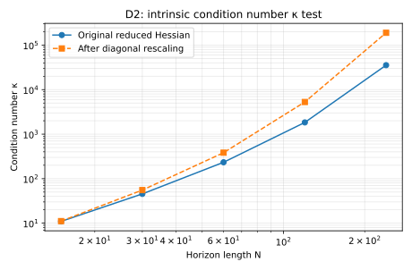
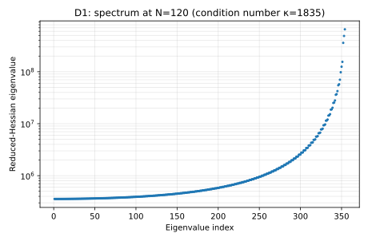
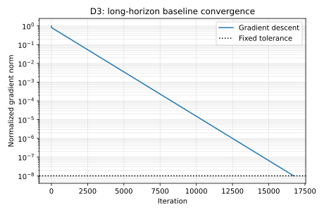
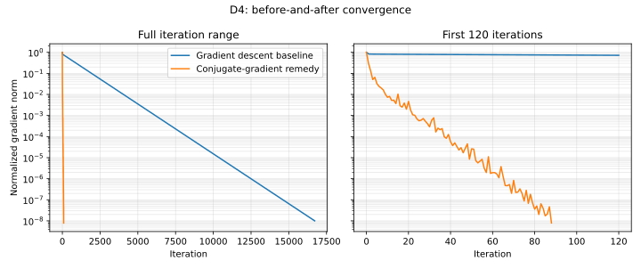

# Spacecraft Rendezvous and Long-Horizon Ill-Conditioning

## Executive summary

This project studies a chaser spacecraft that must rendezvous with a target in circular
low Earth orbit. Mission designers choose a sequence of acceleration commands that
drives the relative position and velocity to zero while limiting tracking error and
control effort. A single-shooting formulation is attractive because it eliminates the
state variables, but its reduced Hessian becomes increasingly ill-conditioned as the
control horizon grows.

The project demonstrates all four required diagnostics on an equality-constrained
benchmark:

- **D1:** at 120 control intervals, the reduced Hessian has condition number
  $\kappa=1834.79$ and an eigenvalue spectrum spanning more than three orders of
  magnitude.
- **D2:** increasing the horizon from 15 to 240 intervals raises $\kappa$ from 10.97 to
  35,474.58. Symmetric diagonal rescaling does not remove the growth; at 240 intervals
  the rescaled condition number is 189,405.40.
- **D3:** fixed-step gradient descent needs 16,718 iterations to reach a normalized
  gradient norm of $10^{-8}$ at 120 intervals.
- **D4:** conjugate gradient reaches the same tolerance in 88 iterations, while a sparse
  multiple-shooting Newton solve satisfies its first-order conditions in one linear
  solve.

The optimization problem assessed in D1–D4 is the equality-constrained exact-rendezvous
problem. A practical mission extension adds the operational
$0.01\ \mathrm{m\,s^{-2}}$ acceleration bound; a separate constrained solve verifies
that extension without mixing active-set behavior into the Family I diagnostic.

## 1. Problem identification and motivation

During proximity operations, a chaser spacecraft must approach a target without
retaining relative position or velocity at the rendezvous time. A mission-design or
guidance team therefore chooses when and how strongly to thrust. Poor numerical
conditioning matters because it can make a mathematically convex planning problem look
computationally difficult: a first-order method may spend thousands of iterations
correcting weakly observable directions while making little progress toward rendezvous.

The concrete setting is target-centered relative motion in a circular Earth orbit. The
model is intentionally educational rather than flight-qualified, but it retains the
coupled in-plane orbital dynamics and the long-horizon sensitivity that motivates
multiple shooting and second-order/Krylov methods in practical trajectory optimization.

## 2. Mathematical formulation

### 2.1 Coordinates, state, and decision variables

The target defines a right-handed local-vertical/local-horizontal frame: $+x$ is
radially outward, $+y$ is along track, and $+z$ is normal to the orbital plane. The
relative state and commanded acceleration are

$$
\mathbf{x}_k=
\begin{bmatrix}
x_k&y_k&z_k&\dot{x}_k&\dot{y}_k&\dot{z}_k
\end{bmatrix}^{T}\in\mathbb{R}^{6},
\qquad
\mathbf{u}_k=
\begin{bmatrix}u_{x,k}&u_{y,k}&u_{z,k}\end{bmatrix}^{T}\in\mathbb{R}^{3}.
$$

| Quantity | Dimension | Units | Type and bounds |
|---|---:|---|---|
| Relative position $(x,y,z)$ | 3 per node | m | Continuous |
| Relative velocity $(\dot x,\dot y,\dot z)$ | 3 per node | $\mathrm{m\,s^{-1}}$ | Continuous |
| Acceleration command $\mathbf u_k$ | 3 per interval | $\mathrm{m\,s^{-2}}$ | Continuous; unbounded in D1–D4, with $\|\mathbf u_k\|_2\le0.01$ in the mission extension |
| Stacked control $\mathbf U$ | $3N$ | $\mathrm{m\,s^{-2}}$ | Primary single-shooting decision variable |

The confirmed initial condition is

$$
\mathbf{x}_0=
\begin{bmatrix}100&-200&20&0&0&0\end{bmatrix}^{T},
$$

and the grid uses a fixed sample time $h=20\ \mathrm{s}$, so the final time is
$T_f=20N\ \mathrm{s}$.

### 2.2 Clohessy-Wiltshire dynamics

For Earth gravitational parameter $\mu=3.986004418\times10^{14}\ \mathrm{m^3s^{-2}}$
and reference-orbit radius $r_0=6{,}778{,}137\ \mathrm{m}$, the mean motion is
$n=\sqrt{\mu/r_0^3}$. The controlled Clohessy-Wiltshire equations are

$$
\begin{aligned}
\ddot{x}-2n\dot{y}-3n^2x &= u_x,\\
\ddot{y}+2n\dot{x} &= u_y,\\
\ddot{z}+n^2z &= u_z.
\end{aligned}
$$

Writing $\dot{\mathbf x}=A\mathbf x+B\mathbf u$ and holding each command constant over
one interval gives the exact discrete dynamics

$$
\mathbf{x}_{k+1}=\Phi\mathbf{x}_k+\Gamma\mathbf{u}_k,
\qquad
\Phi=e^{Ah},
\qquad
\Gamma=\int_0^h e^{A\tau}B\,d\tau.
$$

The implementation evaluates the closed-form $\Phi$ and $\Gamma$ and independently
checks them against a matrix exponential.

### 2.3 Objective and constraints

For desired state $\mathbf x_d=\mathbf0_6$, the discrete objective is

$$
J(\mathbf x,\mathbf u)=
\frac12(\mathbf x_N-\mathbf x_d)^TQ_f(\mathbf x_N-\mathbf x_d)
+\frac{h}{2}\sum_{k=0}^{N-1}
\left[
\mathbf x_k^TQ\mathbf x_k+\mathbf u_k^TR\mathbf u_k
\right],
$$

with

$$
Q=\mathrm{diag}
\left(10^{-4},10^{-4},10^{-4},
78.125579539,78.125579539,78.125579539\right),
\quad Q_f=0_{6\times6},
\quad R=10^4I_3.
$$

The selected optimization problem for D1–D4 is

$$
\begin{aligned}
\underset{\mathbf x_1,\ldots,\mathbf x_N,\,\mathbf u_0,\ldots,\mathbf u_{N-1}}
{\mathrm{minimize}}\quad &J(\mathbf x,\mathbf u)\\
\mathrm{subject\ to}\quad
&\mathbf x_{k+1}=\Phi\mathbf x_k+\Gamma\mathbf u_k,
&&k=0,\ldots,N-1,\\
&\mathbf x_N=\mathbf0_6.
\end{aligned}
$$

All variables are continuous. The objective is convex quadratic and the dynamics and
exact rendezvous constraints are affine, so the selected problem is an
equality-constrained convex quadratic program. The practical mission extension adds
$\|\mathbf u_k\|_2\le0.01\ \mathrm{m\,s^{-2}}$ for every interval. Those inequalities
are second-order-cone constraints, making the extension a convex quadratic-conic
program.

### 2.4 Single- and multiple-shooting forms

Repeated substitution of the dynamics gives

$$
\mathbf{x}_k=\Phi^k\mathbf{x}_0+
\sum_{j=0}^{k-1}\Phi^{k-1-j}\Gamma\mathbf{u}_j.
$$

Stacking the controls produces the condensed objective and terminal equality

$$
J(\mathbf U)=\frac12\mathbf U^TH\mathbf U+\mathbf g^T\mathbf U+c,
\qquad
G_N\mathbf U=-\Phi^N\mathbf x_0,
$$

where

$$
G_N=\begin{bmatrix}
\Phi^{N-1}\Gamma&\Phi^{N-2}\Gamma&\cdots&\Gamma
\end{bmatrix}.
$$

Let $\mathbf U=\mathbf U_p+Z\mathbf w$, where $\mathbf U_p$ satisfies the terminal
equality and the orthonormal columns of $Z$ span $\ker(G_N)$. The diagnostic problem is
the unconstrained positive-definite quadratic

$$
\underset{\mathbf w}{\mathrm{minimize}}\quad
\frac12\mathbf w^TH_r\mathbf w+\mathbf g_r^T\mathbf w+c_r,
\qquad H_r=Z^THZ.
$$

Multiple shooting instead keeps every state as a decision variable. Its Hessian and
dynamics Jacobian are sparse and block structured rather than condensed and dense.

## 3. Ill-conditioning mechanism and intrinsic condition number

This is **Family I: long-horizon dynamics and control**. Each early control appears in
many later states through $\Phi^{k-1-j}\Gamma$. When those sensitivity columns are
inserted into the quadratic path cost, the condensed Hessian contains inner products of
long sequences of propagated sensitivities. Some combinations of controls strongly
affect the trajectory while others nearly cancel, causing the eigenvalues of $H_r$ to
separate as the horizon grows.

This mechanism is structural rather than a units artifact. The sample time and all
physical scales remain fixed while $N$ and therefore the propagation horizon increase.
The required D2 test gives:

| $N$ | Final time (s) | Reduced dimension | $\lambda_{\min}$ | $\lambda_{\max}$ | $\kappa(H_r)$ | After diagonal rescaling |
|---:|---:|---:|---:|---:|---:|---:|
| 15 | 300 | 39 | $3.5791\times10^5$ | $3.9249\times10^6$ | 10.97 | 11.13 |
| 30 | 600 | 84 | $3.5662\times10^5$ | $1.6229\times10^7$ | 45.51 | 55.38 |
| 60 | 1200 | 174 | $3.5630\times10^5$ | $8.3239\times10^7$ | 233.62 | 383.46 |
| 120 | 2400 | 354 | $3.5623\times10^5$ | $6.5360\times10^8$ | 1834.79 | 5280.36 |
| 240 | 4800 | 714 | $3.5621\times10^5$ | $1.2636\times10^{10}$ | 35,474.58 | 189,405.40 |

The smallest eigenvalue stays near $3.56\times10^5$ while the largest grows by more
than three orders of magnitude. Symmetric Jacobi rescaling
$H_r\mapsto D^{-1/2}H_rD^{-1/2}$, $D=\mathrm{diag}(H_r)$, does not collapse the
condition number to order one. It makes the largest case worse, so the intrinsic test is
passed.



As an independent small-case check, a four-interval cross-track reduction gives

$$
H_{r,z}=\begin{bmatrix}
399390.828621 & -36656.773110\\
-36656.773110 & 500873.213215
\end{bmatrix}.
$$

The analytic two-by-two eigenvalue formula gives 387,534.995345 and 512,729.046491,
matching `numpy.linalg.eigvalsh` to machine precision.

## 4. D1 and D3: effect on the baseline optimizer

### 4.1 D1 — reduced-Hessian spectrum

The representative case uses $N=120$, reduced dimension 354. Its eigenvalues range
from $3.56228\times10^5$ to $6.53604\times10^8$, so

$$
\kappa(H_r)=\frac{\lambda_{\max}}{\lambda_{\min}}=1834.79.
$$



### 4.2 D3 — fixed-step gradient descent

The baseline begins at $\mathbf w_0=0$ and uses the optimal constant step for a
positive-definite quadratic,

$$
\alpha=\frac{2}{\lambda_{\max}+\lambda_{\min}}
=3.058290805\times10^{-9}.
$$

The stopping test is

$$
\frac{\|\nabla J(\mathbf w_k)\|_2}
{\|\nabla J(\mathbf w_0)\|_2}\le10^{-8},
$$

with a confirmed maximum of 200,000 iterations. Gradient descent converges in **16,718
iterations**, with final normalized gradient norm $9.99\times10^{-9}$ and objective
2313.664617. The long nearly linear trace on the semilog plot is the computational
effect of the elongated quadratic landscape.



## 5. D4: remedy and before/after demonstration

Two complementary remedies are used.

First, conjugate gradient solves

$$
H_r\mathbf w=-\mathbf g_r
$$

using $H_r$-conjugate search directions. Unlike gradient descent, it does not repeatedly
zig-zag across directions that have already been corrected. For a positive-definite
quadratic its iteration dependence is governed by approximately $\sqrt{\kappa}$ rather
than $\kappa$.

Second, multiple shooting avoids forming the dense condensed sensitivity map. The
equality-only quadratic is solved through the sparse Newton/Karush-Kuhn-Tucker system

$$
\begin{bmatrix}
H_{ms}&A_{eq}^T\\
A_{eq}&0
\end{bmatrix}
\begin{bmatrix}\mathbf z\\\boldsymbol\lambda\end{bmatrix}
\;=\;
\begin{bmatrix}-\mathbf g_{ms}\\\mathbf b_{eq}\end{bmatrix}.
$$

Because the dynamics are linear and the objective is quadratic, one exact Newton linear
solve reaches the optimum.

| Method | Iterations / solves | Final normalized gradient norm | Objective | Result |
|---|---:|---:|---:|---|
| Fixed-step gradient descent | 16,718 iterations | $9.99\times10^{-9}$ | 2313.664617 | Baseline |
| Conjugate gradient | 88 iterations | $7.91\times10^{-9}$ | 2313.664617 | 190-fold fewer iterations |
| Sparse multiple-shooting Newton | 1 linear solve | stationarity $6.82\times10^{-13}$ | 2313.664617 | Equality residual $4.47\times10^{-14}$ |

The sparse and condensed objectives differ by only $3.05\times10^{-14}$ relative. One
representative run took approximately 0.21 s for gradient descent, 0.0012 s for
conjugate gradient, and 0.00082 s for the sparse Newton system. These timings are
machine-dependent, so the deterministic iteration counts and residuals are the primary
comparison.



## 6. Bound-constrained mission validation

The graded D1–D4 problem is equality constrained; the mission extension additionally
enforces the acceleration inequality. At $N=120$, the equality-constrained optimum reaches
$0.01028897\ \mathrm{m\,s^{-2}}$, exceeding the mission limit by
$2.88968\times10^{-4}\ \mathrm{m\,s^{-2}}$. This is why the bound is not silently called
"inactive."

The separate complete constrained demonstration uses $N=60$ and retains
$\|\mathbf u_k\|_2\le0.01\ \mathrm{m\,s^{-2}}$. CVXPY/Clarabel reports an optimal
objective of 2634.273652. Independent verification gives:

| Verification quantity | Value |
|---|---:|
| Maximum dynamics defect | $8.53\times10^{-14}$ |
| Terminal position residual | $1.13\times10^{-14}\ \mathrm m$ |
| Terminal velocity residual | $1.93\times10^{-16}\ \mathrm{m\,s^{-1}}$ |
| Maximum control-bound violation | $4.49\times10^{-10}\ \mathrm{m\,s^{-2}}$ |
| Allowed control verification error | $1.0\times10^{-9}\ \mathrm{m\,s^{-2}}$ |

The deterministic zero-control case is correctly reported as infeasible and exports no
state or control course.

## 7. Assumptions and simplifications

The model assumes a circular two-body reference orbit, small relative separation,
piecewise-constant acceleration, fixed final time, deterministic initial conditions, and
perfect state knowledge. It omits mass depletion, attitude and thruster allocation,
minimum impulse bit, navigation uncertainty, perturbations, collision avoidance,
keep-out zones, approach corridors, line-of-sight constraints, plume impingement, and
communication limits. These omissions make the results educational analysis products,
not flight commands.

## 8. Reproducibility

The calculations are deterministic and use no random sampling. From the repository
root:

```bash
cd Project2-Ill_ConditionedOptimization
python -m venv .venv
source .venv/bin/activate
python -m pip install -e '.[dev]'
python -m pytest
python -m ruff check src tests experiments
python -m mypy src
PYTHONPATH=src python experiments/run_propagation_check.py
PYTHONPATH=src python experiments/run_conditioning_study.py
```

The final command regenerates:

- `Project2-Ill_ConditionedOptimization/outputs/report/diagnostics.json` — complete numerical record;
- `Project2-Ill_ConditionedOptimization/outputs/report/conditioning.csv` — D2 table;
- `Project2-Ill_ConditionedOptimization/outputs/report/convergence.csv` — D3/D4 convergence histories; and
- the four SVG figures embedded above.

The hand check, analytic derivatives, dynamics propagation, solver agreement, infeasible
case, and D1–D4 orchestration all have automated tests.

## 9. Conclusion

Long-horizon Clohessy-Wiltshire rendezvous is intrinsically ill-conditioned in condensed
single shooting. The condition number grows rapidly with the horizon and survives
diagonal rescaling. This causes a quantified baseline slowdown: 16,718 fixed-step
gradient-descent iterations at $N=120$. Conjugate gradient reduces the count to 88, and
the sparse multiple-shooting Newton formulation reaches the same objective while
preserving the dynamics' block structure. The separate bound-constrained solve confirms
that this diagnostic conclusion coexists with a feasible operationally bounded
trajectory.

## References

1. W. H. Clohessy and R. S. Wiltshire, “Terminal Guidance System for Satellite
   Rendezvous,” *Journal of the Aerospace Sciences*, 27(9), 1960, pp. 653–658,
   [doi:10.2514/8.8704](https://doi.org/10.2514/8.8704).
2. MIT OpenCourseWare, *16.346 Astrodynamics, Lecture 26*,
   [lecture notes](https://ocw.mit.edu/courses/16-346-astrodynamics-fall-2008/e4f0632a9f1c98f7e9b25492e1a30eb1_lec_26.pdf).
3. MAE 494/598, [Project 2: Ill-Conditioned Optimization](https://designinformaticslab.github.io/DesignOptimization2025/project2.html).
